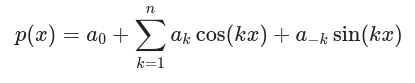

# Trignometric Polynomials

| **Documentation** | **Build Status** |
|:-----------------:|:----------------:|
| [![][docs-stable-img]][docs-stable-url] | [![Build Status][build-img]][build-url] |
| [![][docs-latest-img]][docs-latest-url] | [![Codecov branch][codecov-img]][codecov-url] |


## Documentation

- [**LATEST**][docs-latest-url] &mdash; *in-development version of the documentation.*


## Introduction

[TrigPolys.jl](https://github.com/JuliaAlgebra/TrigPolys.jl) is a package for
fast manipulation of trigonometric polynomials.


A trignometric polynomial is defined on the interval [0, 2π) by



The polynomial p(x) can be represented either by 2n+1 coefficients aₖ or by
evaluations at 2n+1 distinct points in the interval [0, 2π). Each representation
is useful in different situations: the coefficient representation is useful for
truncating or increasing the degree of a polynomial whereas the evaluation
representation is useful for adding and multiplying polynomials.

This package provides the functions `evaluate` and `interpolate` to convert
efficiently between these two representations. These operations are implemented
via the Fast Fourier Transform (FFT) provided by the
[FFTW.jl](https://github.com/JuliaMath/FFTW.jl) library.

For example, multiplying two trigonometric polynomials is implemented with the
following code:

```julia
function Base.:*(p1::TrigPoly, p2::TrigPoly)
    n = p1.n + p2.n
    interpolate(evaluate(pad_to(p1, n)) .* evaluate(pad_to(p2, n)))
end
```


[docs-stable-img]: https://img.shields.io/badge/docs-stable-blue.svg
[docs-latest-img]: https://img.shields.io/badge/docs-latest-blue.svg
[docs-stable-url]: https://juliaalgebra.github.io/TrigPolys.jl/stable
[docs-latest-url]: https://juliaalgebra.github.io/TrigPolys.jl/dev

[build-img]: https://github.com/JuliaAlgebra/TrigPolys.jl/actions/workflows/CI.yml/badge.svg?branch=master
[build-url]: https://github.com/JuliaAlgebra/TrigPolys.jl/actions?query=workflow%3ACI
[codecov-img]: https://codecov.io/gh/JuliaAlgebra/TrigPolys.jl/branch/master/graph/badge.svg
[codecov-url]: https://codecov.io/gh/JuliaAlgebra/TrigPolys.jl/branch/master
